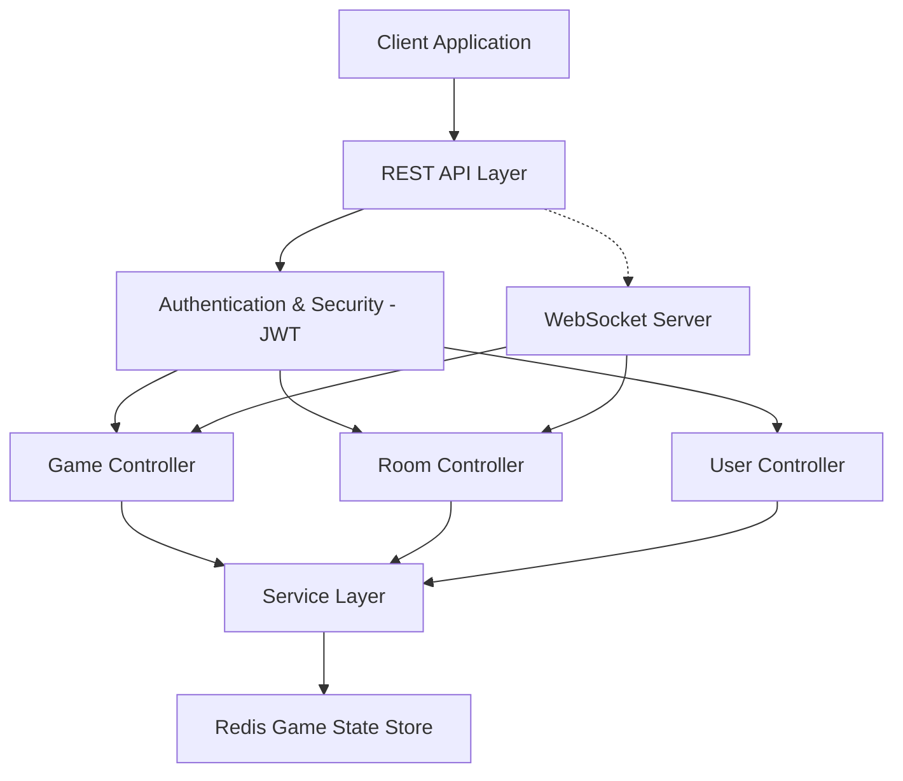

# SpadeBreakLive_Backend

## Introduction

SpadeBreakLive_Backend is the server-side engine for SpadeBreakLive, a real-time multiplayer card game inspired by classic trick-taking games such as Spades and Callbreak. Players join rooms using a unique ID, place bets each round, and compete by playing cards to win tricks and earn points.

The backend manages user authentication, room creation, real-time gameplay, and score calculation through scalable APIs and WebSocket connections. Built with Spring Boot and Redis, it is designed for reliability, performance, and cloud deployment.

## Features

- User registration, authentication, and session management.
- Real-time multiplayer gameplay for card games.
- Game room creation, joining, and management.
- Matchmaking logic and player tracking.
- Comprehensive scoring and leaderboard systems.
- Robust error handling and input validation.
- RESTful API endpoints for all client interactions.
- Modular architecture for easy feature extension.
- Logging and debugging for game and user events.

## Requirements

To run SpadeBreakLive_Backend, ensure your environment meets the following requirements:

- Java Development Kit (JDK 17 or newer)
- Spring Boot framework
- Gradle or Maven (for build and dependency management)
- Redis (cloud or local instance for game state management)
- Environment variables for configuration (Redis credentials, server port, JWT secrets, etc.)
- WebSocket-enabled runtime environment
- AWS Elastic Beanstalk (optional, for production deployment)

## Architecture Overview

The backend follows a modular and layered architecture built with Spring Boot. Core components are separated into controllers, services, and domain models, while Redis is used for managing real-time game state and player sessions. Real-time communication between clients and the server is handled using WebSockets to ensure low-latency multiplayer gameplay.

